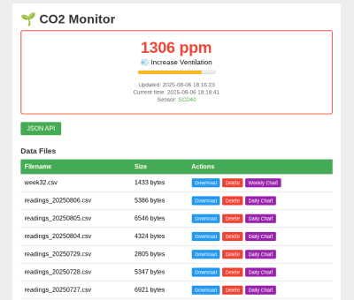

# CO2 Monitor for Raspberry Pi Pico W

A MicroPython-based CO2 monitoring system that provides real-time air quality measurements with web dashboard and data logging capabilities.



## Features

- **Real-time CO2 monitoring** using SCD40 sensor via I2C
- **Web dashboard** with live readings and air quality status
- **Data logging** to SD card with CSV format
- **Interactive charts** for daily and weekly CO2 trends
- **Daily/weekly data rotation** with automatic file management
- **WiFi connectivity** for remote monitoring
- **Accurate timekeeping** with DS3231 RTC module

## Air Quality Categories

- **👍 Excellent** (≤ 1000 ppm) - Good air quality
- **💨 Increase Ventilation** (1000-1500 ppm) - Moderate air quality
- **🚨 Action Required** (> 1500 ppm) - Poor air quality

## Hardware Requirements

- Raspberry Pi Pico W
- SCD40 CO2/Temperature/Humidity sensor
- DS3231 Real-Time Clock module
- SD card module
- MicroSD card

## Pin Connections

| Component | Pin | GPIO |
|-----------|-----|------|
| SCD40 SCL | Pin 7 | GPIO 5 |
| SCD40 SDA | Pin 6 | GPIO 4 |
| DS3231 SCL | Pin 7 | GPIO 5 |
| DS3231 SDA | Pin 6 | GPIO 4 |
| SD Card SCK | Pin 14 | GPIO 10 |
| SD Card MOSI | Pin 15 | GPIO 11 |
| SD Card MISO | Pin 16 | GPIO 12 |
| SD Card CS | Pin 17 | GPIO 13 |

## Setup

1. **Flash MicroPython** to your Pico W
2. **Create WiFi credentials** file `password_work.txt`:
   ```
   YourWiFiSSID
   YourWiFiPassword
   ```
3. **Deploy files** to Pico W:
   ```bash
   make push_all
   ```
4. **Run the system**:
   ```bash
   make run
   ```

## Development Commands

### MicroPython Device Operations
- `make run` - Run main.py on connected device
- `make push` - Copy main.py to device
- `make push_all` - Copy all files to device (including templates)
- `make pull_main` - Copy main.py from device to local
- `make ls` - List files on device

### HTML Development and Testing
- `make generate-html` - Generate all HTML files with fake data
- `make preview-dashboard` - Generate and open dashboard (excellent conditions)
- `make preview-daily` - Generate and open daily chart
- `make preview-weekly` - Generate and open weekly chart
- `make clean-html` - Remove generated HTML files

## Web Interface

Once running, the device hosts a web server accessible via its IP address:

- `/` - Main dashboard with current readings
- `/co2` - JSON API for current CO2 value
- `/spark/<filename>` - SVG chart generation from CSV data
- `/download/<filename>` - Download log files
- `/delete/<filename>` - Delete log files
- `/status` - System information

## Data Storage

### CSV Log Format
```csv
time,co2
2025-08-06 14:30:00,750
2025-08-06 14:35:00,820
```

### File Organization
- **Daily logs**: `/sd/readings/readings_YYYYMMDD.csv` (5-minute intervals)
- **Weekly logs**: `/sd/readings/week{N}.csv` (hourly aggregates)

## Template System

The project uses **utemplate** - a lightweight templating engine:
- **Source templates**: `templates/*.tpl` (human-readable)
- **Compiled templates**: `templates/*_tpl.py` (MicroPython-optimized)

When editing templates, update both source and compiled versions.

## Testing with Fake Data

The `generate_html.py` script creates realistic test scenarios:

```bash
# Generate all scenarios
python3 generate_html.py all

# Generate specific dashboard scenario
python3 generate_html.py dashboard --scenario excellent --open
python3 generate_html.py dashboard --scenario ventilation --open
python3 generate_html.py dashboard --scenario action --open

# Generate chart types
python3 generate_html.py daily --open
python3 generate_html.py weekly --open
```

## Architecture

### Data Flow
1. **SCD40 sensor** reads CO2/temp/humidity every 5 minutes
2. **DS3231 RTC** provides accurate timestamps
3. **Data logging** saves measurements to SD card
4. **Web server** serves dashboard and API endpoints
5. **Chart generation** creates SVG visualizations from CSV data

### Air Quality State Management
CO2 readings are categorized into exactly 3 states with corresponding visual indicators and recommended actions.

## License

MIT License - see LICENSE file for details